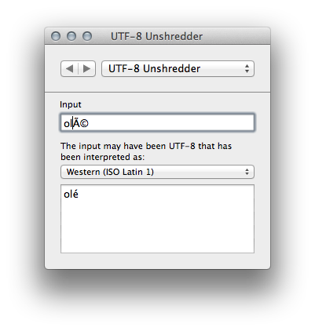
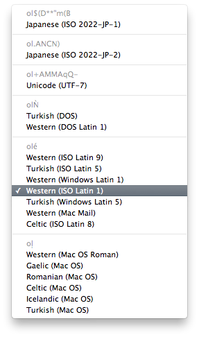

# UTF-8 Unshredder

UTF-8 Unshredder is a Utility for [UnicodeChecker](http://earthlingsoft.net/UnicodeChecker) that attempts to fix the encoding problems of UTF-8 encoded text that has been read with the wrong encoding and saved as UTf-8 again.

You typically recognise such problems when seeing character combinations with letters like à where your non-ASCII roman characters should be.

## Examples

* Character: é
* … encoded as UTF-8: `C3 A9`
* … read as ISO Latin-1: é

If you end up with such garbled text, UTF-8 Unshredder will try to figure out which text encodings may have played a role in garbling the text and what the original string may have been. This way you can both reconstruct the original string and figure out how exactly it was broken.

Example with two iterations:

* Garbled text: Grundgebühr
* … may have been accidentally processed as Mac OS Roman: Grundgeb√ºhr
* … may have been accidentally processed as Mac OS Roman: Grundgebühr

## Screenshots

UTF-8 Unshredder in UnicodeChecker’s Utility window:

Encoding selection popup menu:

## Copyright & License

2008-2014 by Sven-S. Porst, earthlingsoft <[ssp-web@earthlingsoft.net](mailto:ssp-web@earthlingsoft.net?subject=Earth%20Addresser)>

[MIT Licensed](Web/License.text)